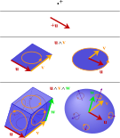

## Introduction

$\nextSection$

The current description of quantum mechanics, and so quantum information, is based on vectors in a complex Hilbert space being acted upon by operators on that Hilbert space.
However, this isn't the only valid approach to the subject.
I'd like to present another approach, which fits well with another mathematical framework that has the ability to contain many areas of physics.

The reason this may be desired is that it allows for a smaller barrier to entry between fields in physics due to the familiar mathematical framework.
If you are a physicist, or aspiring physicist, you may agree that there are many wonderful and enticing areas of study.
However, these areas are quite complex, conceptually, and having different mathematical frameworks between fields doesn't exactly make it easy to delve into another field productively.

## A Brief Introduction to Geometric Algebra

$\nextSection$

### From Tensor Algebra to Geometric Algebra {#sec-tensors}

The contents of this section are not required to understand the main take away of this article, but is here for those interested.

Consider a vector space $V$.
The tensor algebra generated by this space is

\begin{align}
	T(V) &= \bigoplus_{n=0}^\infty V^{n},\\
	V^n &= \bigotimes_{l=0}^{n} V,\\
	V^{0} &\equiv F,
\end{align}
where $F$ is the field over which the vectorspace is taken.

The Geometric algebra (or Clifford algebra) is the quotient of the tensor algebra with $v\otimes v - \ip{v}$, where $v \in V$ and $\ip{v}: V \rightarrow F$ is a chosen quadratic form, which induces a symmetric bilinear form:

\begin{align}
	Cl(V) \equiv \frac{T(V)}{v\otimes v - \ip{v}}.
\end{align}

Additionally, there may be subscripts $p,q,r$, i.e., $Cl_{p,q,r}$, representing the pseudometric signature, or the degeneracy of normalized eigenvalues of the bilinear form.

Interestingly, if one takes $\ip{v}$ to be the zero quadratic form, this gives Grassman's exterior algebra.

### Elements in Geometric Algebra

There are several different types of elements in geometric algebra.
The major players, however, are vectors, which are used to build higher dimensional objects through the geometric product, which is the tensor product, under the construction given in @sec-tensors.
(We will see another use of the tensor product later.)

Vectors can be combined into higher dimensional objects using Grassman's wedge (or exterior) product.
In @fig-k-blades, there are depictions of these objects.
Note, scalars can be thought of as 0-dimensional objects with orientation.

::: {#fig-k-blades}

{width=50%}

This figure shows several different k-blades, along with how they are constructed using the wedge product.
:::

Generally, any given object in the algebra has an orientation indicated by the sign (either positive or negative) in front of the object.
These objects are called "$k$-blades", where $k$ is the number of vectors used to build the blade.

#### Versors

Versor
: The object created using the geometric product of any number of unit vectors.

### Real Space

#### 2D

Let's start with a simple example, and move up from there.
In two dimensional Euclidean geometry, one can select an orthonormal basis consisting of two vectors, $\{\sigma_1, \sigma_2\}$.
These two vectors span the vector space $\R^2$.
Imposing the standard Euclidean metric allows this vector space to generate the geometric algebra $Cl_2(\R^2)$.
This algebra contains four basis elements:

\begin{align}
	\{1,\sigma_1,\sigma_2,\sigma_1\sigma_2\}.\nonumber
\end{align}

#### 3D

Let's consider the vector space $\R^3$, and a Clifford algebra generated by it and the Euclidean metric, $Cl_3(\R^3)$.
While the formulae tend to be coordinate free, it is easier to introduce new individuals by picking a basis to start out with, so I'll use the Cartesian orthonormal basis, $\{\sigma_n\}_{n=1}^{3}$.

## Single Qubits

$\nextSection$

### Spinors

The typical setup is to consider a two dimensional spinor: $\ket{\psi}$, where the components are complex.
This spinor can be visualized as a single point on the Bloch sphere, where antipoles are orthogonal states.

However, I'd like to start from the Bloch sphere visualization.
Consider an arbitrary point on the Bloch sphere, $n$.
It's easy to see that this point can be represented by rotating the point $\sigma_3$:
\begin{align}
	n &= R\sigma_3 R^\dagger, \qquad \text{(vector)}\\
	R &= e^{-\phi \sigma_{12}/2}e^{-\theta \sigma_{31}/2}. \qquad \text{(spinor)}
\end{align}
One can verify that this object, $R$, is isomorphic to the 2D complex spinor, so this is what I will use:
\begin{align}
	\psi = e^{-\phi \sigma_{12}/2}e^{-\theta \sigma_{31}/2}.
\end{align}

### Gates

In order to determine how gates act on these states, consider the transformation that the gates perform to the state on the Bloch sphere:

- **Not Gate** The not gate, also the pauli-x matrix causes a state to reflect across the $\sigma_1$ axis.
- **Hadamard Gate** The Hadamard gate is the combination $\hat{H} = (\hat{\sigma}_1+\hat{\sigma}_3)/\sqrt{2}$.
It has the effect of reflecting about this axis.

These simple gates continue in this manner.
"Linear combinations" of Pauli gates are reflections across the Pauli vector that they represent.
Using this idea, it's quite simple to translate the these transformations into the new representation.
In order to reflect an object across a specific vector in geometric algebra all one needs to do is the sandwich product.
For example,
\begin{align}
	\hat{\sigma}_1 & &\rightarrow& & \underline{\sigma_1}(a) &= \sigma_1 a \sigma_1^{-1},\\
	&&&&&= \sigma_1 a \sigma_1.\\
	\hat{\sigma}_2 & &\rightarrow& & \underline{\sigma_2}(a) &= \sigma_2 a \sigma_2,\\
	\hat{H} & &\rightarrow& & \underline{H}(a) &= \frac{1}{2} (\sigma_1 + \sigma_3)a(\sigma_1 + \sigma_3).
\end{align}
Hence, the spinor (the quantum state), can be transformed as illustrated.

## Construction

$\nextSection$

Consider $Cl_{n+2}(\R)$, with the basis
\begin{align}
	\{e_i\}_{i=0}^{n} + \{r_1,r_2\},
\end{align}
where
\begin{align}
	e_1^2 = e_2^2 = \dots = e_n^2 = r_i^2 = 1,
\end{align}
and all elements anticommute.
Call the bivector $\iota = r_1r_2$.
Next, construct the quantum register algebra (QRA):
\begin{align}
	QRA = \text{span}\{\}
\end{align}

We construct the Witt basis,

\begin{align}
	f_i &= \frac{1}{2}(e_i + \iota e_{i+n})\\
	f_i^\dagger &= \frac{1}{2}(e_i - \iota e_{i+n}).
\end{align}