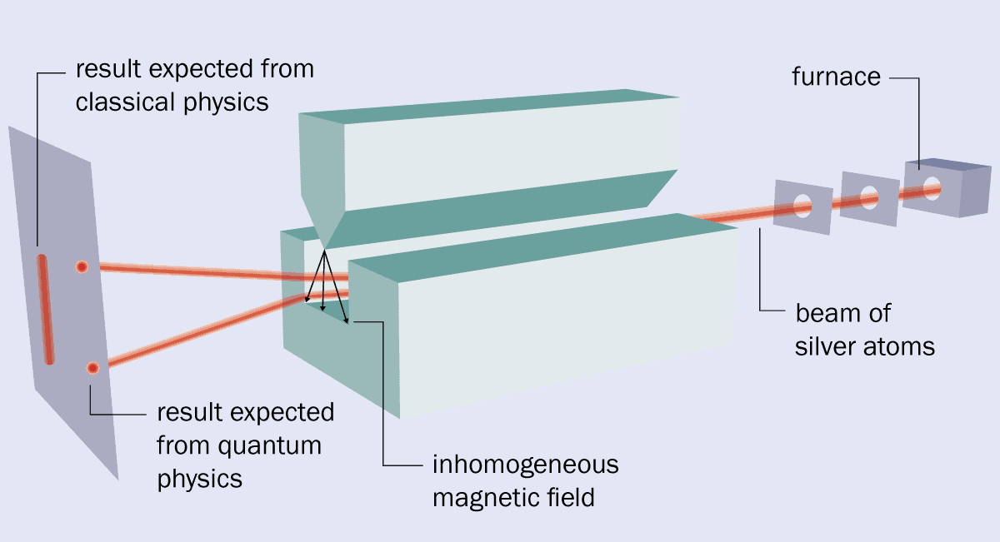

Given some angular momentum, $L$, and gyromagnetic ratio, $\gamma$, the magnetic moment is
\begin{equation}
	M = \gamma L
\end{equation}
For a magnetic moment in a diverging magnetic field, the force felt by said magnetic moment is nonvanishing:
\begin{equation}
	f = -\nabla V = -\nabla (M\cdot B)
\end{equation}
With a beam of silver atoms, the magnetic moments of each atom can be pointed in any direction, so it is expected that the beam will become dispersed over a line parallel to the magnetic field, $IB$.
However, what is observed is that the beam splits into two beams, one with magnetic moments parallel to $B$ and another with magnetic moments antiparallel to $B$.
The measurements of the magnetic moments of the silver atoms seems to be "quantized" with two possible measurements.

## Sequential Measurements

$\nextSection$

Consider a double Stern-Gerlach experment, where one set up is followed by another one, but the inhomogeneous magnetic field is oriented parallel to the first.
The two beams leaving the first experiment have known magnetic moments.
If one of those outgoing beams is input into the second experiment experiment, what will happen?
The incoming beam, with known magnetic moment, will be deflected in the exact same way as before, so the entire beam will go one way, instead of two, as seen in the first experiment.
However, if the second experiment is rotated, so that the inhomogeneous magnetic field is at some angle relative to the first experiment, one will see the second beem appear.

This is very similar to photon polarization.
When a lightwave goes through a polarizer, it's forced into a polarization that is parallel to the polarizer.
If it then encounters a polarizer with an orientation perpendicular to the first, all of the light is stopped.
However, with a polarizer oriented at some angle between parallel and perpendicular, some ratio of the light will pass through this second polarizer.
Here, the difference is that the angle for the same phenomonon to occur is doubled in the case of the Stern-Gerlach experiment.